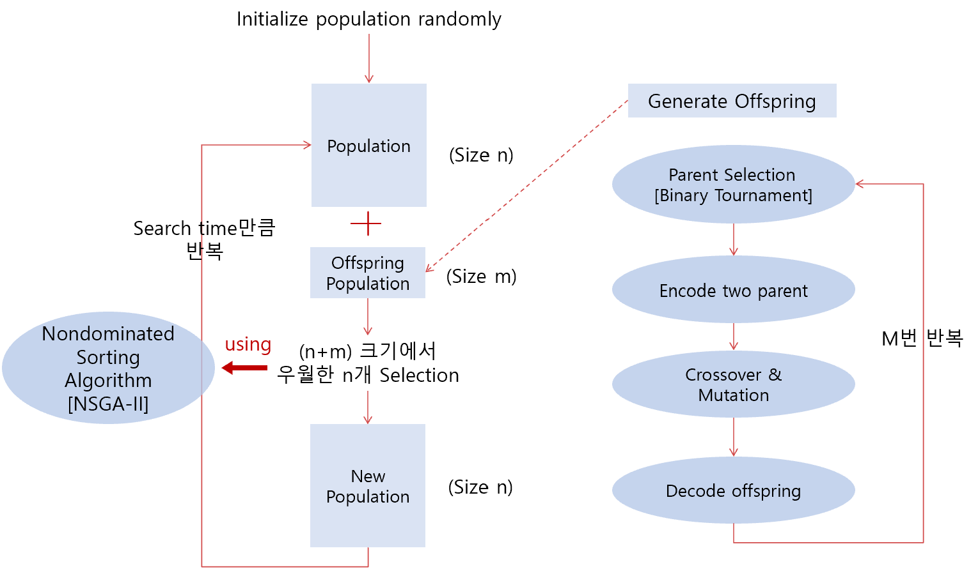
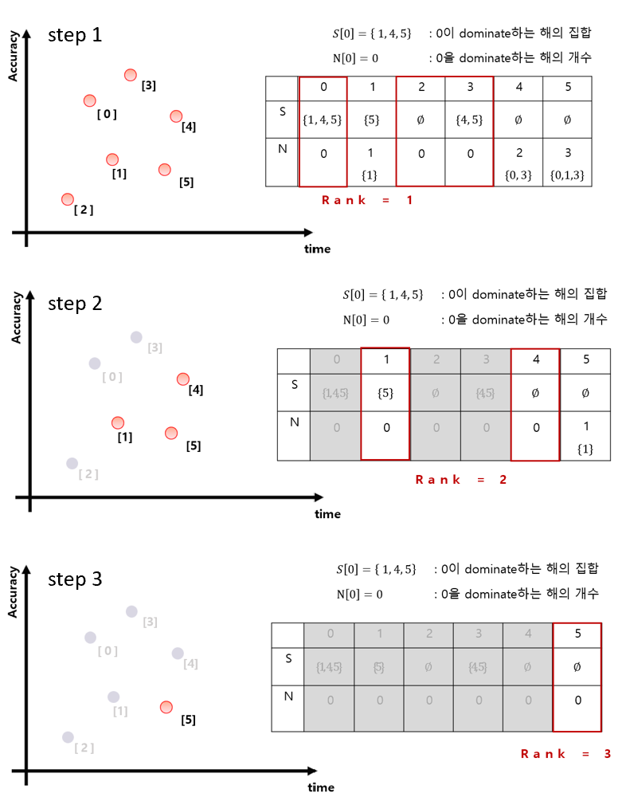
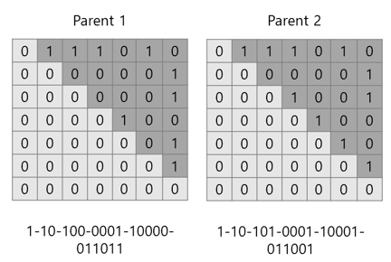
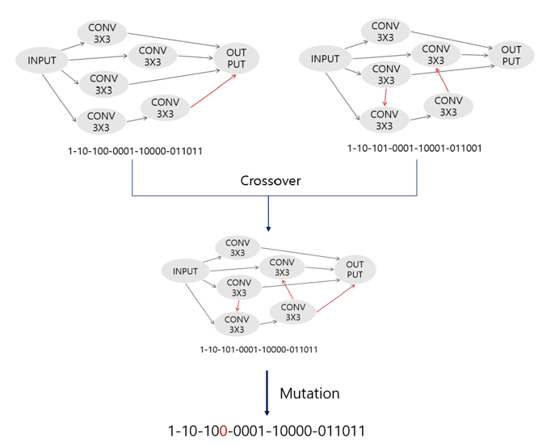
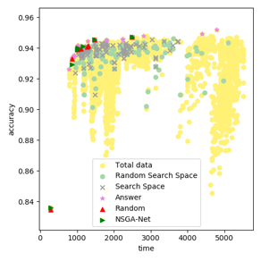
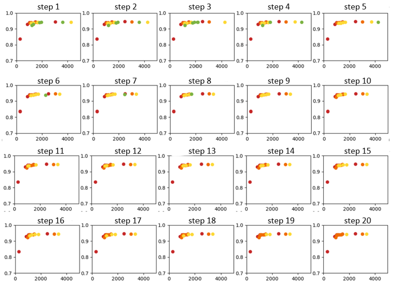

# Implement NSGA2
Based on <https://www.iitk.ac.in/kangal/Deb_NSGA-II.pdf>

Using <https://github.com/google-research/nasbench>

## Setup
1. download cuda 10.0, tensorflow 1.15, python 3.6
2. execute setup.py

## Flow

1. Initialize population randomly.
2. Generate offspring.
    1. Choose two parents by tournament selection.
    2. Encode selected two parents.
    3. Crossover.
    4. Mutation by using bitwise.
    5. Decode offspring.
    6. Check offspring is valid.
3. Combine parent and offspring population.
4. Fast non dominated sort: assign 'rank'
5. Crowding distance assignment
6. Select next parent population by Crowded Comparison Operator.

[Model Outline]

[Nondominated Sorting]

[Generate Offspring]

## Data Structure
* population is list of elems.
  
  elem = {'acc': data['validation_accuracy'], 'time': data['training_time'], 'spec': spec}

## Experiment

At every step of the evolution, the rank in the nonnominated sorting is expressed by red, orange, yellow, and green in the increasing order.

